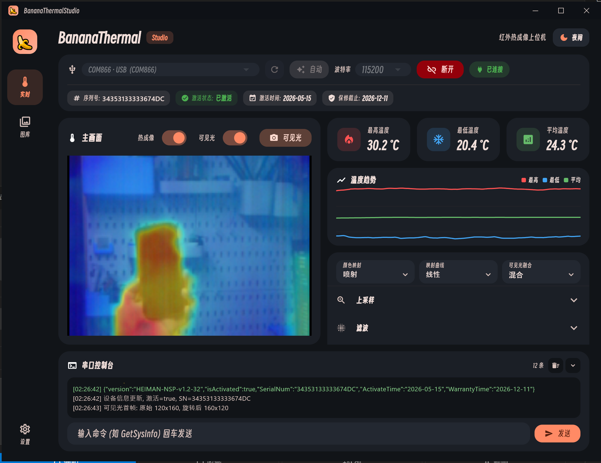
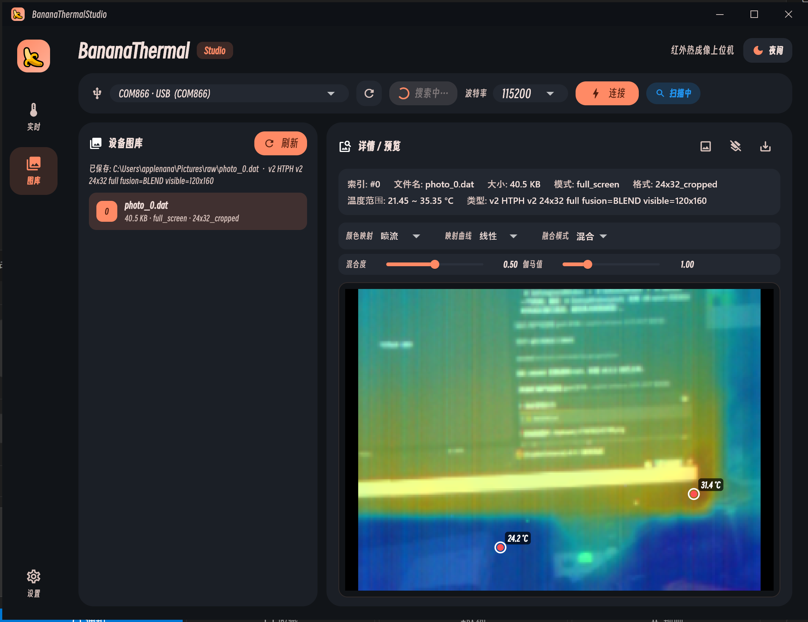

<h1 align="center">🍌 Next BananaThermal Studio</h1>

<p align="center">
  <b>基于 Flutter 桌面的新一代香蕉泥热成像上位机</b><br>
  <sub>更现代 · 更美观 · 更易用 · 单 exe 即开即用</sub>
</p>

<p align="center">
  <a href="https://github.com/applenana/NextBananaThermalStudio/actions/workflows/build-windows.yml">
    
  </a>
  <a href="https://github.com/applenana/NextBananaThermalStudio/releases/latest">
    
  </a>
  
  
  
</p>

---

## 📖 简介

**Next BananaThermal Studio** 是 [BananaThermal Studio](https://github.com/applenana/BananaThermal-Studio) (Python/Tk 版) 的下一代重写，使用 **Flutter Desktop** 打造原生体验的桌面 GUI，适配开源 **香蕉泥热成像通讯协议** (RP2040 + Heimann HTPA + OV2640)。

> Tk 上位机的功能在这里以更现代的方式重新交付：丝滑的动画、原生窗口体验、深浅主题、矢量伪彩，以及完整的设置持久化。

## ✨ 特性

- 🎨 **自绘标题栏** — 无 Windows 蓝色 active caption，原生窗口拖拽 / 双击最大化 / 边缘 8 向 resize
- 🔥 **双光实时显示** — 热成像 `24×32 float` + 可见光 `RGB565`，单串口 1 Mbps 多路复用
- 🌈 **可调伪彩** — 多套内置调色板 + 自定义冷/中/热三色 + 线性/S 曲线映射
- 📈 **温度曲线** — Tmax / Tmin / Tavg 实时滚动（`fl_chart`），节流重绘不卡帧
- 📥 **片上图库下载** — 把 RP2040 flash 里的 JPEG 批量拉到 PC，支持温度叠加批注
- 🧠 **纯 Dart 协议解析** — 状态机分流 `BEGIN/END`（热）与 `VBEG/VEND`（可见光），可单测
- 🔌 **串口自动识别** — `flutter_libserialport` 跨平台扫描，无须装驱动
- 🌗 **深 / 浅主题** + **UI 缩放** + **窗口尺寸持久化** + **一键恢复出厂**
- 💬 **内置命令行控制台** — 直发原始命令（`stream` / `vstream` / `GetSysInfo` / `activate <key>` ……），分级彩色日志
- 🚀 **单 exe 发布** — GitHub Actions 每次 push 自动构建，tag push 自动发 Release

## 🖼️ 截图

### 实时双光主页



> 自绘标题栏 · 自动搜索连接 · 序列号 / 激活时间 / 保修截止一目了然 · 温度曲线 + 伪彩可视化 + 串口控制台。

### 设备图库



> 列表点击即下载并解码 (v2-HTPH / full_screen / 24×32 cropped) · 可见光融合 + 任意位置温度标记 · PNG 一键导出。

## 🚀 快速开始

### 直接下载

到 [Releases](https://github.com/applenana/NextBananaThermalStudio/releases) 下载最新版 `banana_thermal-windows-x64.zip`，解压即用。

### 从源码运行

需要 [Flutter SDK 3.41+](https://docs.flutter.dev/get-started/install)（Dart 3.11+），Windows 端还需 Visual Studio 2022 with **Desktop development with C++**。

```powershell
git clone https://github.com/applenana/NextBananaThermalStudio.git
cd NextBananaThermalStudio
flutter pub get
flutter run -d windows
```

### 构建发布版

```powershell
flutter build windows --release
# 产物：build\windows\x64\runner\Release\banana_thermal.exe
```

## 🗂️ 目录结构

```
lib/
├── main.dart                # 入口 + 全局持久化设置
├── app_state.dart           # 应用级 state (Provider)
├── protocol/                # 串口协议解析 (FrameParser)
└── ui/
    ├── home_shell.dart      # 主框架（自绘标题栏 + 侧栏 + 主区）
    ├── realtime_tab.dart    # 实时双光页
    ├── photo_download_tab.dart
    ├── widgets/
    │   ├── window_title_bar.dart  # 自绘标题栏
    │   └── thermal_canvas.dart
    └── window_size_ffi.dart # Win32 FFI（拖拽/最大化/尺寸）
windows/runner/              # Win32 宿主（自定义 NC frame）
assets/
├── fonts/SmileySans-Oblique.ttf
└── icons/icon.png
```

## 📡 协议

参见上一代 [BananaThermal Studio 协议文档](https://github.com/applenana/BananaThermal-Studio#-protocol--%E5%8D%8F%E8%AE%AE)。Dart 端实现位于 [`lib/protocol/`](lib/protocol/)，与 Python `frame_parser.py` 行为一致。

## 🛠️ 开发笔记

- 自绘标题栏方案：保留系统 NC frame 用于 resize/snap/Aero，仅 `WM_NCCALCSIZE` 吃掉 caption。Flutter 子窗口四边内缩 6px，把 resize 边缘命中区让给顶层 `WM_NCHITTEST`。
- 无 `window_manager` 等 native plugin —— 避免与 `flutter_libserialport` 的 Win32 资源冲突。窗口拖拽 / 最大化 / 关闭通过 `dart:ffi` 直接调 user32 完成。
- 全部设置走 `shared_preferences`：主题、UI 缩放、窗口大小、控制台展开、图片目录…… 设置页提供"恢复出厂"。

## 📜 License

[MIT](LICENSE) © 2026 applenana
