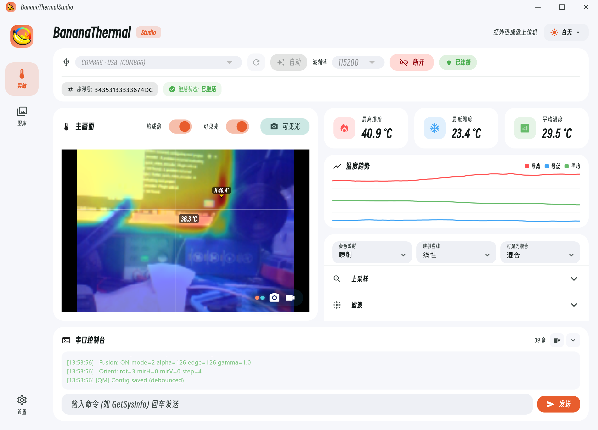
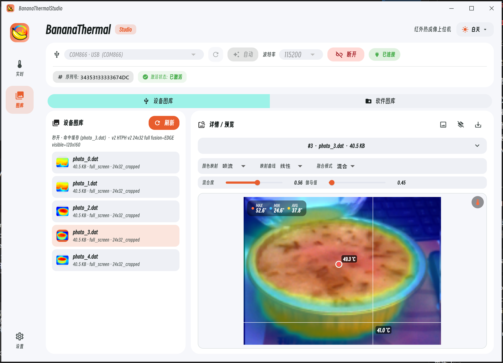
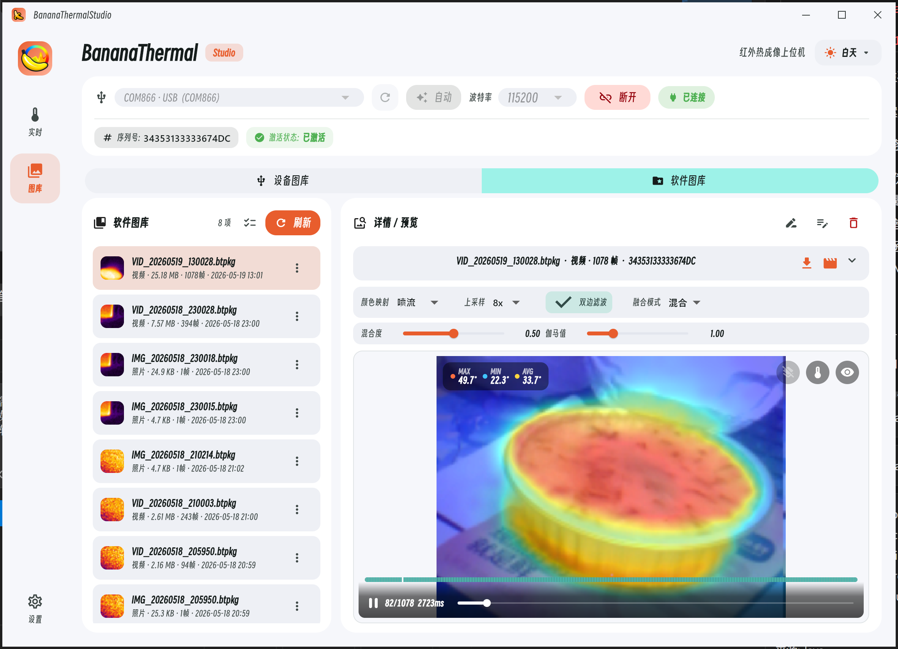
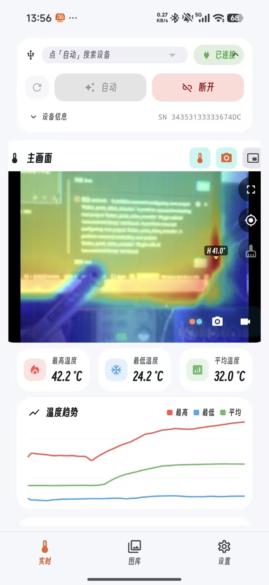
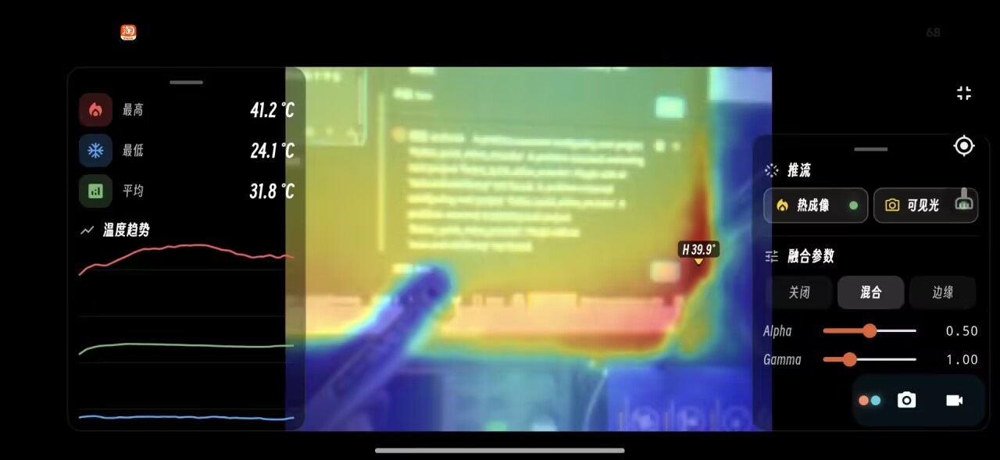
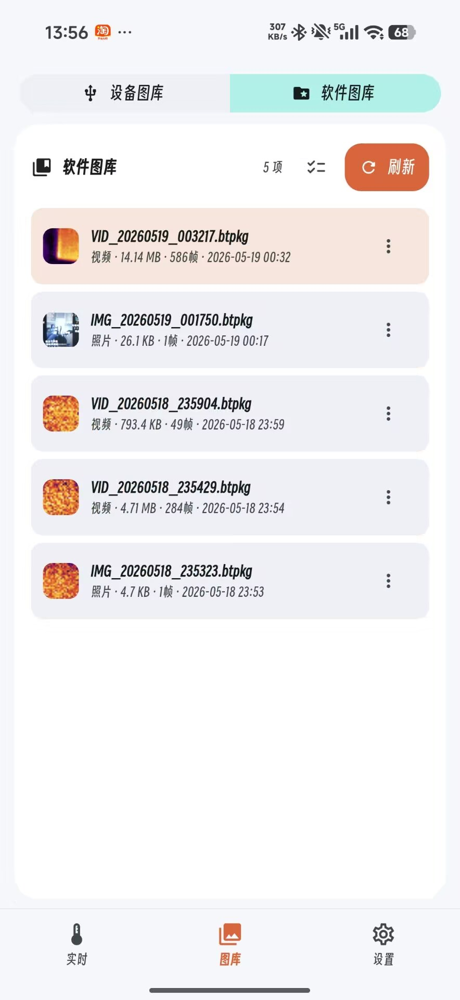

<h1 align="center">🍌 Next BananaThermal Studio</h1>

<p align="center">
  <b>香蕉泥热成像跨平台上位机 — Windows 桌面 + Android 移动端</b><br>
  <sub>双光融合 · 实时推流 · 一键录制 · 图库管理 · 温度分析 · 单文件即开即用</sub>
</p>

<p align="center">
  <a href="https://github.com/applenana/NextBananaThermalStudio/actions/workflows/build.yml">
    
  </a>
  <a href="https://github.com/applenana/NextBananaThermalStudio/releases/latest">
    
  </a>
  
  
  
</p>

---

> **📥 萌新看这里！**
>
> - **想要最新测试版？** → 点上方 CI 徽章，或进入 [Actions](https://github.com/applenana/NextBananaThermalStudio/actions/workflows/build.yml) 找到最新一次成功的构建，点开 **Artifacts** 下载各平台打包好的软件，抢先体验最新功能（可能不稳定）。
> - **想要稳定发行版？** → 直接去 [Releases](https://github.com/applenana/NextBananaThermalStudio/releases/latest) 下载带版本号的正式包，开箱即用，不会踩坑。

---

## 📖 简介

**Next BananaThermal Studio** 是 [BananaThermal Studio](https://github.com/applenana/BananaThermal-Studio) (Python/Tk 版) 的下一代重写，基于 **Flutter** 打造跨平台原生体验，适配开源 **香蕉泥热成像通讯协议**。

> 同一份代码，桌面走串口直连，Android 走 USB Host CDC 自动识别 —— 开箱即用，无须驱动，无须 Python 环境。

### 通讯协议文档

欢迎使用我们的协议！设计简单易用，已在多款热成像上试装通过。

| 协议 | 文档 |
|---|---|
| 串口实时推流协议（热成像帧 / 可见光帧交织） | [docs/protocol_streaming.md](docs/protocol_streaming.md) |
| 图片下载协议（v1 Simple / v1 Full / v2 HTPH 双光） | [docs/protocol_photo_download.md](docs/protocol_photo_download.md) |

---

## 🖼️ 截图

### Windows 桌面

<table>
  <tr>
    <td align="center" width="50%"><b>实时双光主页</b></td>
    <td align="center" width="50%"><b>设备图库 · 温度标记 + 叠加 HUD</b></td>
  </tr>
  <tr>
    <td></td>
    <td></td>
  </tr>
  <tr>
    <td>自绘标题栏 · 双光融合 · 实时温度曲线 · 串口控制台 · 序列号 / 激活状态一目了然。</td>
    <td>列表缩略图 · MAX/MIN/AVG 温度叠加 HUD · 可见光/热成像对比 · 任意位置温度标记。</td>
  </tr>
  <tr>
    <td align="center"><b>软件图库 · 视频逐帧播放</b></td>
    <td></td>
  </tr>
  <tr>
    <td></td>
    <td></td>
  </tr>
  <tr>
    <td>.btpkg 视频包逐帧播放 · 进度条可拖拽 · 帧级别温度叠加 · 一键导出 MP4。</td>
    <td></td>
  </tr>
</table>

### Android 移动端

<table>
  <tr>
    <td align="center" width="33%"><b>实时主页（竖屏）</b></td>
    <td align="center" width="33%"><b>全屏模式（横屏）</b></td>
    <td align="center" width="33%"><b>软件图库列表</b></td>
  </tr>
  <tr>
    <td></td>
    <td></td>
    <td></td>
  </tr>
  <tr>
    <td>USB Host 一键连接 · 温度卡片 · 实时曲线 · 底部标签栏导航。</td>
    <td>横屏全屏沉浸式 · 左侧统计面板 · 右侧融合参数 · 内嵌拍摄栏。</td>
    <td>.btpkg 列表 · 热成像缩略图 · 照片 / 视频自动分类。</td>
  </tr>
</table>

---

## ✨ 特性一览

### 🔴 实时双光

- **热成像 + 可见光同步** — `24×32 float` 热图与 `RGB565` 可见光单串口 1 Mbps 多路复用，Flutter 层逐帧融合渲染
- **可调伪彩** — 内置多套调色板（iron / rainbow / 灰阶…）+ 自定义冷/中/热三色，线性或 S 曲线映射
- **温度曲线** — `fl_chart` 实时滚动 Tmax / Tmin / Tavg，节流重绘不卡帧
- **全屏模式（Android）** — 沉浸式全屏显示热成像画面，右下角内嵌拍摄/录制控制栏

### 📸 拍摄与录制

- **天蓝色胶囊拍摄栏** — 悬浮于画面右下角，不遮挡主要区域；Android 全屏模式下直接内嵌于画面内
- **零延迟触发** — 推流中途可随时拍摄单帧或开始/停止录制，不中断实时显示
- **GPS 定位标记** — 每次拍摄自动附加经纬度及反向地理编码地名（Android/桌面均支持）
- **`.btpkg` 格式** — v2 槽位式独立帧容器，热成像 + 可见光按帧对齐存储，视频可逐帧随机访问

### 🖼️ 图库管理

**设备图库（片上存储）**

- 列表点击即通过串口协议下载并解码，支持 `v2-HTPH` / `full_screen` / `24×32 cropped` 多种格式
- **单次会话缩略图缓存** — 首次打开后列表序号位置自动替换为热成像渲染缩略图（96 px，优先热成像，降级为 JPEG）；再次点同一张秒开，完全跳过串口 IO + 解码
- 刷新列表时自动清空单次缓存（持久 sha256 磁盘缓存不受影响）
- **可见光融合** — 双光设备图片支持热/可见光切换叠加
- **任意位置温度标记** — 点击画面任意位置添加标记点，实时读取对应热像素温度，导出时烘焙到 PNG

**软件图库（本地 `.btpkg`）**

- 视频包逐帧播放，播放进度条可拖拽跳帧；播到末帧再次点击从头重放
- 同款热/可见光融合与温度标记，**标记位置不变、温度跟随当前帧实时更新**
- **一键导出** — 单帧导出为 PNG；视频包导出为 **MP4**（Android 走 MediaCodec 硬编，Windows 随附 1.3 MB 迷你 ffmpeg）

### 🌡️ 温度叠加 HUD

- 详情预览左上角半透明浮层实时显示 **MAX / MIN / AVG 温度**，默认开启，一键关闭
- 视频播放时每帧自动更新
- 导出 PNG / MP4 时叠加数据同步烘焙到画面（不单独导出无叠加版）

### 📐 图片详情增强

- **元数据卡可折叠** — 默认单行摘要（索引 · 文件名 · 大小），点击展开完整元数据（格式 / 模式 / 温度范围 / GPS 地名等）
- 参数调节面板（色域拉伸 / min-max 锁定 / 融合透明度）位于折叠卡下方

### 🔌 连接与兼容

- **Windows** — `flutter_libserialport` 扫描 COM 口，无须驱动，支持手动 / 自动连接切换
- **Android** — `usb_serial` USB Host CDC-ACM / CH34x / FTDI / CP210x 自动识别，USB 授权弹窗后即连
- **手动连接优先** — 用户手动选择端口后，自动扫描不再抢占已选端口

### 🔐 设备激活

- 串口连接后自动检测激活状态（`GetSysInfo` 响应 `isActivated`）
- 未激活时弹出毛玻璃遮罩，展示可复制序列号 + 闲鱼售后链接 + QQ 群获取激活码入口
- 激活码输入并发送 `activate <key>` 后自动验证，错误有专属错误层提示

### 🎨 界面与体验

- **自绘标题栏（Windows）** — 保留系统 NC frame 用于 resize/snap/Aero，吃掉 caption 实现无蓝条；拖拽/最大化/关闭通过 `dart:ffi` 直调 user32
- **深 / 浅主题** + Material 3 青蓝绿色方案
- **UI 缩放** + **窗口尺寸持久化** + **一键恢复出厂**
- **BananaToast** — 全局轻提示，替代 SnackBar，不遮挡主内容
- **内置命令行控制台** — 直发原始命令，分级彩色日志
- **设备固件全自动烧录（Windows / Android）** — 连接后严格识别双光设备型号与当前固件，自动提示新版，也可选择任意正式版本升级、降级或重刷；下载后逐层校验 GitHub 摘要、manifest、大小、UF2 SHA-256 和 RP2040 块结构，再自动进入 Bootloader、写入、重连并回读目标版本。未知或其他热成像默认拒绝烧录
- **自定义 UF2 烧录（Windows / Android 优先，macOS / Linux 兼容）** — 可选择本地 RP2040 UF2 并写入唯一的 BOOTSEL 目标；文件先复制到应用私有缓存，再在写入前复核完整块结构和 SHA-256。第三方固件无法验证型号、Flash 容量与功能兼容性，因此必须勾选明确的风险知情确认后才能解锁烧录
- **跨端自动更新** — 官方 GitHub 优先，受限时由多个镜像交叉验证版本信息并自动切换下载源；检测失败后每分钟重试。仅有一个镜像返回有效数据时允许降级，但会在弹窗中明确提示未交叉验证；所有自动安装资产仍强制校验文件大小与 SHA-256。Android 调用系统安装器，Windows 使用开源 NSIS Setup 覆盖升级

### 🤖 CI / CD

- 每次推送自动构建 Windows x64 + Android arm/arm64 APK
- Tag 推送自动生成分类 Changelog 并发布 GitHub Release（feat/fix/perf/refactor 分节，ci/chore 折叠）
- Tag Release 同时提供 Windows Setup / 便携 ZIP 与 Android universal APK

---

## 🚀 快速开始

### 直接下载（推荐）

前往 [Releases](https://github.com/applenana/NextBananaThermalStudio/releases/latest) 下载：

| 平台 | 文件 | 说明 |
|------|------|------|
| Windows x64（推荐） | `BananaThermal-windows-x64-setup.exe` | 安装版，支持应用内下载后覆盖升级 |
| Windows x64（便携） | `BananaThermal-windows-x64.zip` | 解压后运行 `banana_thermal.exe`，含迷你 ffmpeg |
| Android | `BananaThermal-android.apk` | universal APK，覆盖 arm / arm64 |

### 从源码运行

需要 [Flutter SDK 3.41+](https://docs.flutter.dev/get-started/install)（Dart 3.11+）。

```powershell
git clone https://github.com/applenana/NextBananaThermalStudio.git
cd NextBananaThermalStudio
flutter pub get

# Windows
flutter run -d windows

# Android（连接设备后）
flutter run -d <device-id>
```

Windows 还需 **Visual Studio 2022 with "Desktop development with C++"**。

### 更新镜像与校验

应用始终优先访问 GitHub 官方 API 和 Release 资产。只有官方源失败时才会访问公共镜像，不会向镜像发送账号、Token 或设备数据：

- 版本元数据后备：`gh-proxy.com`、`gh-proxy.org`、`gh-proxy.cn`、`gh.llkk.cc`、`ghproxy.homeboyc.cn`、`ghproxy.cfd`、`github.chenc.dev`、`hub.gitmirror.com`。
- 两个或更多镜像可用时，只有版本、官方 URL、文件大小和 SHA-256 达成唯一多数一致结果才会接受；多个有效响应互相冲突且无法形成唯一结果时会拒绝更新。
- 恰好只有一个镜像返回有效版本信息时允许降级继续，但更新弹窗会醒目标明“未交叉验证”。文件大小与 SHA-256 此时只能保证下载内容和该镜像声明一致，不能替代多源真实性验证。
- 安装包下载后备：除上述镜像外再尝试 `ghproxy.net`、`ghfast.top`，按顺序故障转移。
- 自动安装要求 Release 资产提供有效的文件大小和 SHA-256；任何来源下载的文件都必须同时匹配，否则立即删除并尝试下一源。缺少摘要时只允许手动查看发布页。
- 启用自动检查后，每次冷启动都会实际查询最新版本；若检测失败，则每隔 1 分钟重试，直到成功获得“已是最新版”“有新版本”或“已忽略版本”中的确定结果。同一时刻只运行一个检查请求。

公共镜像可能随时变更、停服或返回过期内容，不应被视为版本真实性的单一信任来源；单镜像模式是为了受限网络下的可用性而提供的显式降级。

### 设备固件自动烧录

连接设备后，Studio 会读取 `GetSysInfo` 中的设备族和 `firmwareVersion`，并查询 [BananaThermalFirmware Releases](https://github.com/applenana/BananaThermalFirmware/releases)。当前固件源只分发 `HEIMAN-NSP` 3.2 寸双光设备固件；其他型号、字段冲突或无法确认型号时会禁止自动烧录，不能仅凭串口协议兼容或 UF2 文件名放行。

- Windows 和 Android 均可在“设置 → 设备固件”选择任意正式版本进行升级、降级或重刷。程序优先尝试 1200-baud 自动进入 RP2040 Bootloader；旧固件不支持时，按界面提示使用 BOOTSEL / RESET。Android 页面会分别显示串口、BOOTSEL、待授权、已授权、写入和重连阶段；失败后可从仍然连接的唯一 RP2040 USB 磁盘继续。
- 旧固件没有上报 Flash 容量，因此第一次必须明确选择 8 MB 性能版、8 MB 稳定版或 2 MB 兼容版。选择按设备序列号保存；不能根据三个 UF2 相同或相近的文件大小猜测容量。
- 自动写入前会验证官方 Release URL、GitHub SHA-256、`manifest.json` 版本/设备族/变体、文件大小、UF2 SHA-256、RP2040 family ID、块序和目标地址；任何一层冲突都会停止。
- 烧录会先断开串口并停止推流，写入完成后自动搜索设备，再用 `GetSysInfo` 回读版本。切换 2 MB / 8 MB 分区或跨版本降级前，必须先备份照片、温度校准、触摸校准和双光对齐参数。
- Android 需要手机支持 USB Host / OTG。设备从串口重新枚举为 Bootloader 后，系统会再次询问 USB 访问权限；授权成功以系统实际权限状态为准，即使个别系统遗漏授权回调也能继续。Studio 会核对官方 RP2040 VID/PID、Mass Storage 接口、FAT16 BPB、`RPI-RP2` 卷及 `INFO_UF2.TXT`，复位 Bulk-Only 传输状态后直接通过 SCSI 写入。系统授权不能静默绕过，写入期间请勿拔线、关闭 OTG 或退出应用。

#### 烧录自定义 UF2

“设置 → 设备固件 → 烧录自定义 UF2”允许选择用户自己的 `.uf2` 文件。此入口与官方固件管理完全分离：它只验证文件是连续、仅写 RP2040 主 Flash 地址范围的 UF2，以及写入前文件大小和 SHA-256 未变化，**不能证明固件适配当前热成像型号、Flash 容量、分区或外设**。错误固件可能导致串口消失、无法启动、校准参数或照片丢失；请先保存可恢复的官方固件与设备数据。

- Windows 与 Android 是主要支持端，沿用唯一目标检测、1200-baud 切换、BOOTSEL 授权/识别和写入流程；Android 仍会检查 RP2040 VID/PID、Mass Storage、FAT16、卷标与 `INFO_UF2.TXT`。
- macOS 与 Linux 可写入已挂载且带有效 `INFO_UF2.TXT` 的 RP2040 UF2 磁盘；macOS 沙箱构建会要求用户通过系统目录选择器明确选择 `RPI-RP2` 根目录。
- 页面同时出现串口设备和 UF2 磁盘、检测到多个 UF2 目标、权限未授予或目标不满足 RP2040 特征时都会拒绝开始。用户必须勾选风险知情复选框，确认兼容性由自己负责并已备份重要数据。

### Android Release 签名（维护者必读）

Android 只有在新旧 APK 使用同一证书签名时才能覆盖升级。Tag 构建会强制读取以下 GitHub Actions Secrets；任何一项缺失都会终止发布，避免生成无法升级的临时签名 APK：

- `ANDROID_KEYSTORE_BASE64`：release keystore 文件的 Base64 内容
- `ANDROID_KEYSTORE_PASSWORD`
- `ANDROID_KEY_ALIAS`
- `ANDROID_KEY_PASSWORD`

可用 JDK 的 `keytool` 创建一次长期密钥，将其离线备份后配置到仓库 Secrets。不要提交真实的 `key.properties` 或 keystore；本地格式可参考 [`android/key.properties.example`](android/key.properties.example)。

仓库同时提供安全辅助脚本：运行 `tools/generate_android_signing_key.ps1` 生成本地签名和独立恢复备份；完成 `gh auth login` 后，运行 `tools/configure_android_signing_secrets.ps1` 可把四项 Secret 写入 GitHub，脚本不会在终端打印密码。

> 历史 CI 使用 Runner 临时 debug keystore，不同构建之间无法保证签名一致。因此切换到首个持久签名版本时，已安装旧 APK 的用户可能需要先备份数据、卸载旧版再安装一次；此后的应用内升级即可保持连续。

### 构建发布版

```powershell
# Windows
flutter build windows --release
# 产物：build\windows\x64\runner\Release\banana_thermal.exe

# Android（arm + arm64 分包）
flutter build apk --release --split-per-abi --target-platform android-arm,android-arm64
# 产物：build\app\outputs\flutter-apk\app-*-release.apk
```

---

## 🗂️ 目录结构

```
lib/
├── main.dart                  # 入口 + 全局持久化设置
├── app_state.dart             # 应用级 state (Provider)
├── protocol/                  # 串口协议解析 (FrameParser + PhotoCacheIndex)
├── fusion/                    # 双光融合渲染管线
├── render/                    # 伪彩 / 参数 / renderPipeline
├── serial/                    # 串口适配层 (桌面 / Android USB)
├── storage/                   # .btpkg 读写 / 文件存储
└── ui/
    ├── home_shell.dart        # 主框架（自绘标题栏 + 侧栏 + 主区）
    ├── realtime_tab.dart      # 实时双光页（含全屏模式）
    ├── photo_download_tab.dart   # 设备图库
    ├── software_gallery_tab.dart # 软件图库（.btpkg 播放 + 导出）
    ├── activation_overlay.dart   # 设备激活遮罩
    └── widgets/
        ├── thermal_canvas.dart   # 热成像画布 + 温度标记交互
        ├── temp_overlay.dart     # MAX/MIN/AVG 温度 HUD（两端图库共用）
        ├── rgb_image_view.dart
        └── window_title_bar.dart # 自绘标题栏
windows/runner/                # Win32 宿主（自定义 NC frame）
android/                       # Android USB Host 权限 / 串口与 RP2040 SCSI 烧录桥
assets/
├── fonts/SmileySans-Oblique.ttf
└── icons/
```

---

## 📡 协议简介

串口协议参见 [BananaThermal Studio 协议文档](https://github.com/applenana/BananaThermal-Studio#-protocol--%E5%8D%8F%E8%AE%AE)。Dart 端实现在 [`lib/protocol/`](lib/protocol/)，与 Python `frame_parser.py` 行为一致，含完整单元测试。

常用命令速查：

| 命令 | 说明 |
|------|------|
| `stream` | 开始热成像推流 |
| `vstream` | 开始可见光推流 |
| `stopstream` | 停止推流 |
| `GetSysInfo` | 查询设备信息（SN / 激活状态 / 保修截止）|
| `activate <key>` | 激活设备 |
| `calibration get` | 查询温度线性校准系数（JSON） |
| `calibration set <gain> <offset>` | 原子写入并保存温度线性校准系数 |
| `calibration reset` | 恢复并保存默认校准系数 `1.0 / 0.0` |
| `GetPhotoList` | 获取片上图库列表 |
| `GetPhoto <index>` | 下载指定索引的图片 |

---

## 🛠️ 开发笔记

- **自绘标题栏**：保留系统 NC frame 用于 resize/snap/Aero，仅 `WM_NCCALCSIZE` 吃掉 caption。Flutter 子窗口四边内缩 6 px，resize 边缘命中区交由顶层 `WM_NCHITTEST`。无 `window_manager` plugin —— 避免与 `flutter_libserialport` 的 Win32 资源冲突。
- **迷你 ffmpeg**：用 MSYS2 + x264 自编译，仅含 rawvideo→H.264→MP4 管线，最终 UPX 压缩后 **1.3 MB**，随 Release 一同打包进 Windows 发布包。
- **单次会话缓存**：`_session`（filename → raw/decoded/thumb）仅在内存中，刷新时清空。与 `PhotoCacheIndex`（sha256 磁盘缓存）完全独立，互不干扰。
- **温度标记坐标**：以归一化浮点 `(px, py)` 存储，画布缩放不影响标记位置；导出时按目标分辨率重映射。
- **全部设置走 `shared_preferences`**：主题、UI 缩放、窗口大小、控制台展开、图片目录…… 设置页提供"恢复出厂"。

---

## 📜 License

[MIT](LICENSE) © 2026 applenana
